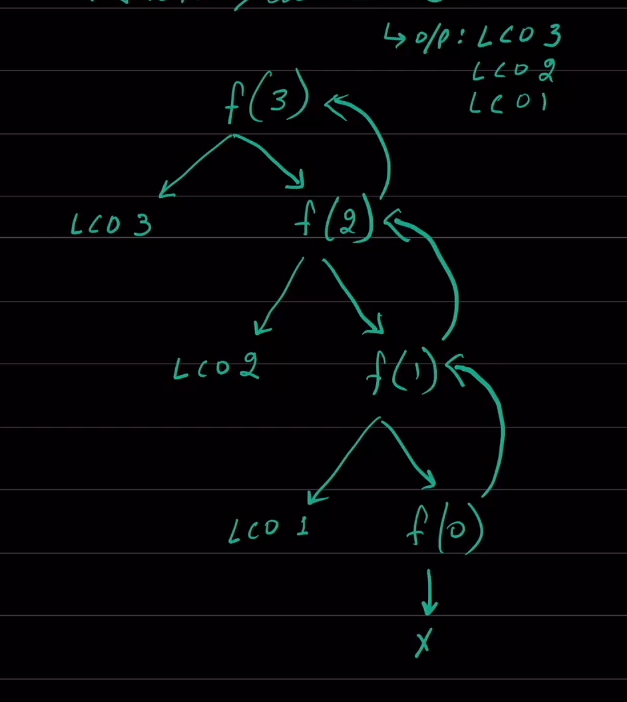
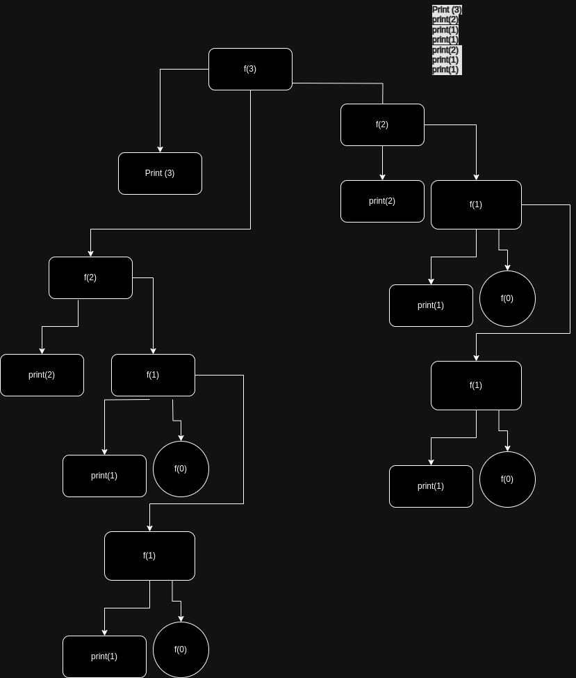

# recursion is the program which calls itself with a base case defined 

- track forward 
- track back word 

# Tracing Tree
- Track Forward  
- Track Backward  


```python
def tree_tracking(n):
    if n > 0:
        print("call", n)
        tree_tracking(n - 1)
```


```python
tree_tracking(3)
```

    call 3
    call 2
    call 1





```python
def back_tree_tracking(n):
    if n > 0:
        tree_tracking(n - 1)
        print("call", n)
```


```python
back_tree_tracking(3)
```

    call 2
    call 1
    call 3


TYpe of recursion 
- head/top recursion 
-  Tail/bottom 
- tree recursion 


```python
def back_tree_tracking(n):
    if n > 0:
        print("call", n)
        back_tree_tracking(n - 1)
        back_tree_tracking(n - 1)
```


```python
back_tree_tracking(3)
```

    call 3
    call 2
    call 1
    call 1
    call 2
    call 1
    call 1





```python
# factorial
def factorial(n):
    if n <= 1:
        return 1
    else:
        return n * factorial(n - 1)
```


```python
factorial(6)
```


    720


```python
def fibonacci(n):
    if n < 0:
        return 0
    if n == 1:
        return 0
    if n == 2:
        return 1
    else:
        return fibonacci(n - 1) + fibonacci(n - 2)
```


```python
fibonacci(11)
```


    55


```python
def TowerOfHanoi(n, source, destination, auxiliary):
    if n == 1:
        print(f"Move disk 1 from {source} to {destination}")
        return
    TowerOfHanoi(n - 1, source, auxiliary, destination)
    print(f"Move disk {n} from {source} to {destination}")
    TowerOfHanoi(n - 1, auxiliary, destination, source)


n = 3
TowerOfHanoi(n, "A", "C", "B")
```

    Move disk 1 from A to C
    Move disk 2 from A to B
    Move disk 1 from C to B
    Move disk 3 from A to C
    Move disk 1 from B to A
    Move disk 2 from B to C
    Move disk 1 from A to C


```python
def power(base, exponent):
    """_summary_

    Args:
        base (_type_): _description_
        exponent (_type_): _description_

    Returns:
        _type_: _description_
    """
    if exponent == 0:
        return 1
    if exponent < 0:  # handle neg power
        return 1 / power(base, exponent * -1)
    else:
        return base * power(base, exponent - 1)
```


```python
power(2, 3)
```


    8


```python
power(2, -1)
```


    0.5


```python
def find_combinations_recursive(data, r, current_combination=[], start=0):
    """
    This function finds all combinations of r elements from a list using recursion.

    Args:
        data: The list of elements.
        r: The number of elements to choose for each combination.
        current_combination: A list to store the current combination being built (internal use).
        start: The starting index for recursion (internal use).

    Returns:
        None (function modifies a passed list)
    """
    if len(current_combination) == r:
        all_combinations.append(
            current_combination.copy()
        )  # Append a copy to avoid modification
        return

    for i in range(start, len(data)):
        current_combination.append(data[i])
        find_combinations_recursive(
            data, r, current_combination, i + 1
        )  # Move to next element for next combination
        current_combination.pop()  # Backtrack and remove the element after exploring its combinations


# Example usage
import random

random.seed(1965)
my_list = [random.randint(1, 100) for _ in range(15)]
r = 2  # Choose 2 elements at a time
all_combinations = []

find_combinations_recursive(my_list, r)
```


```python
my_list
```


    [82, 89, 43, 45, 95, 73, 70, 23, 75, 99, 9, 68, 48, 20, 57]


```python
all_combinations
```


    [[82, 89],
     [82, 43],
     [82, 45],
     [82, 95],
     [82, 73],
     [82, 70],
     [82, 23],
     [82, 75],
     [82, 99],
     [82, 9],
     [82, 68],
     [82, 48],
     [82, 20],
     [82, 57],
     [89, 43],
     [89, 45],
     [89, 95],
     [89, 73],
     [89, 70],
     [89, 23],
     [89, 75],
     [89, 99],
     [89, 9],
     [89, 68],
     [89, 48],
     [89, 20],
     [89, 57],
     [43, 45],
     [43, 95],
     [43, 73],
     [43, 70],
     [43, 23],
     [43, 75],
     [43, 99],
     [43, 9],
     [43, 68],
     [43, 48],
     [43, 20],
     [43, 57],
     [45, 95],
     [45, 73],
     [45, 70],
     [45, 23],
     [45, 75],
     [45, 99],
     [45, 9],
     [45, 68],
     [45, 48],
     [45, 20],
     [45, 57],
     [95, 73],
     [95, 70],
     [95, 23],
     [95, 75],
     [95, 99],
     [95, 9],
     [95, 68],
     [95, 48],
     [95, 20],
     [95, 57],
     [73, 70],
     [73, 23],
     [73, 75],
     [73, 99],
     [73, 9],
     [73, 68],
     [73, 48],
     [73, 20],
     [73, 57],
     [70, 23],
     [70, 75],
     [70, 99],
     [70, 9],
     [70, 68],
     [70, 48],
     [70, 20],
     [70, 57],
     [23, 75],
     [23, 99],
     [23, 9],
     [23, 68],
     [23, 48],
     [23, 20],
     [23, 57],
     [75, 99],
     [75, 9],
     [75, 68],
     [75, 48],
     [75, 20],
     [75, 57],
     [99, 9],
     [99, 68],
     [99, 48],
     [99, 20],
     [99, 57],
     [9, 68],
     [9, 48],
     [9, 20],
     [9, 57],
     [68, 48],
     [68, 20],
     [68, 57],
     [48, 20],
     [48, 57],
     [20, 57]]


```python
class Solution(object):
    def latestTimeCatchTheBus(self, buses, passengers, capacity):
        """
        :type buses: List[int]
        :type passengers: List[int]
        :type capacity: int
        :rtype: int
        """
        buses_sorted = sorted(buses)
        passengers_sorted = sorted(passengers, reverse=True)
        for bus in buses_sorted:
            temp_cap = capacity
            current_passenger_list = []
            while temp_cap > 0 and passengers_sorted:

                current_passenger = passengers_sorted.pop()
                if current_passenger > bus:
                    passengers_sorted.append(current_passenger)
                    break
                else:
                    temp_cap -= 1
                    current_passenger_list.append(current_passenger)
        return self.best_time(current_passenger_list)

    def best_time(self, L):
        for index in range(len(L) - 1, -1, -1):
            if L[index] - L[index - 1] > 1:
                return L[index] - 1
            else:
                # Check for base case (list with only 2 elements)
                if len(L) == 2 and L[index] - L[index - 1] == 1:
                    return L[index - 1] - 1
        return L[0] - 1
```


```python
busses = [10, 20]
passengers = [2, 17, 18, 19]
capacity = 2

s = Solution()
passenger_list = s.latestTimeCatchTheBus(
    buses=busses, passengers=passengers, capacity=capacity
)
```


```python
def latestTimeCatchTheBus(self, buses, passengers, capacity):
    buses.sort()
    passengers.sort()
    passenger_index = 0
    latest_time = -1

    for bus in buses:
        current_capacity = 0

        while (
            current_capacity < capacity
            and passenger_index < len(passengers)
            and passengers[passenger_index] <= bus
        ):
            current_capacity += 1
            passenger_index += 1

        if current_capacity < capacity:
            latest_time = bus
        else:
            latest_time = passengers[passenger_index - 1] - 1

        while latest_time in set(passengers):
            latest_time -= 1

    return latest_time
```

    20


```python

```


```python
passenger_list
```


    16


```python
def best_time(L):
    for index in range(len(L) - 1, 0, -1):
        if L[index] - L[index - 1] > 1:
            return L[index] - 1
        else:
            # Check for base case (list with only 2 elements)
            if len(L) == 2 and L[index] - L[index - 1] == 1:
                return L[index - 1] - 1
    return L[0] - 1  # Default selling time (unchange
```


```python
va = best_time(passenger_list)
```


```python
va
```


    16


```python
passengers_sorted = sorted(passengers, reverse=True)
```


```python
passengers_sorted.pop()
```


    2


```python

```
