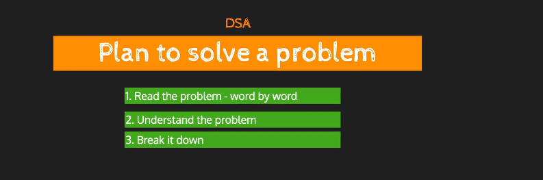

```python
import os
import numpy as np

os.chdir("..")
os.chdir("..")
from driver_folder.time_driver import TimerError
```


```python
T = TimerError()
T.start()
end_time = T.elapsed()
print(f"time taken:{end_time}")
```

    time taken:1.5173995052464306e-05


```python
input_str = "prince"
```


```python
def reverse(string):
    string = string[::-1]
    return string
```


```python
reverse(input_str)
```


    'ecnirp'


```python
def reversetwo(string: str) -> str:
    str = ""
    for i in string:
        str = i + str
    return str
```


```python
reversetwo(input_str)
```


    'ecnirp'





```python

```


