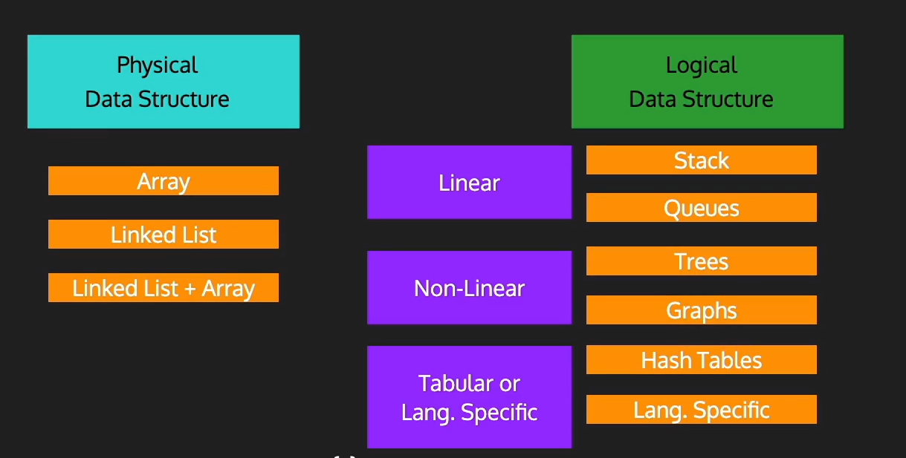
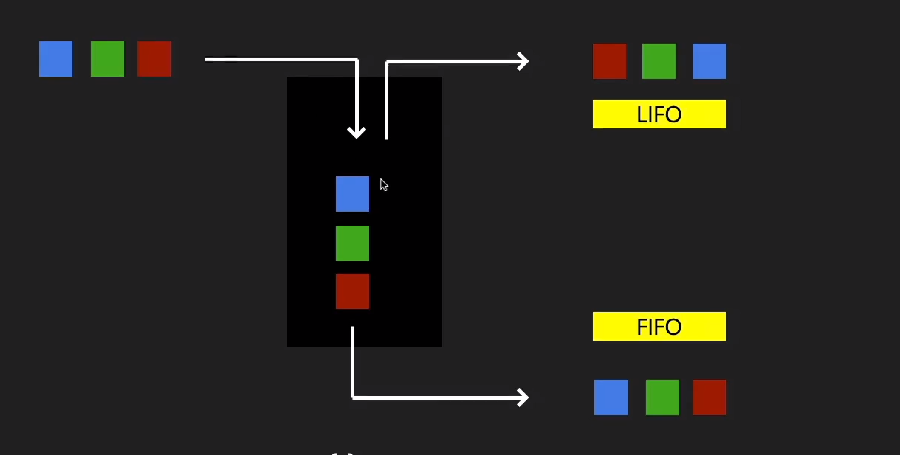

```python
import os
import numpy as np

os.chdir("..")
os.chdir("..")
from driver_folder.time_driver import TimerError
```


```python
T = TimerError()
T.start()
end_time = T.elapsed()
print(f"time taken:{end_time}")
```

    time taken:1.444100053049624e-05






# Abstract Datat Type 

- list 
- stack 
- queue 


```python

```
