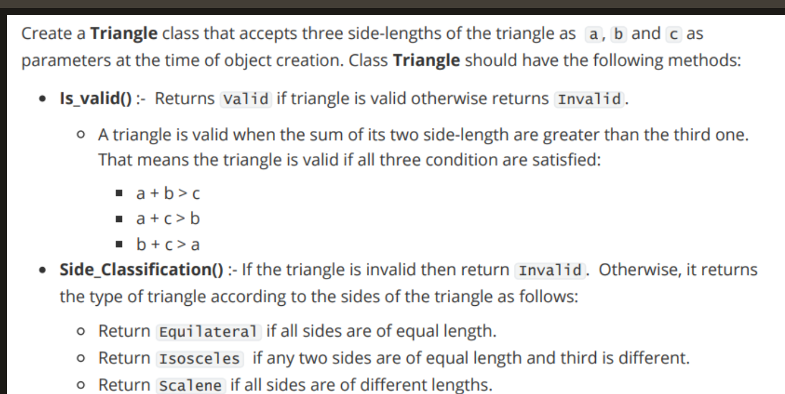
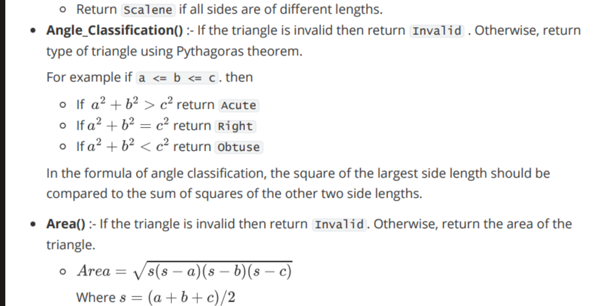

```python
import os
import numpy as np

os.chdir("..")
os.chdir("..")
from driver_folder.time_driver import TimerError
```


```python
T = TimerError()
T.start()
end_time = T.elapsed()
print(f"time taken:{end_time}")
```

    time taken:1.277799992749351e-05





```python
def isprime(num: int) -> bool:
    if num <= 1:
        return False
    if num == 2:
        return True
    if num % 2 == 0:
        return False
    for factor in range(3, int(num**0.5) + 1, 2):
        if num % factor == 0:
            return False
    return True
            

def Twin_Primes(n: int, m: int) -> list:
    result = []
    for num in range(n, m-1):
        if isprime(num) and isprime(num + 2):
            result.append((num, num + 2))
    return result
                
```


```python
n=int(input())
m=int(input())
print(sorted(Twin_Primes(n, m)))
```

    [(3, 5), (5, 7), (11, 13)]





```python
j = [1,2,3]

value = j.pop()
j= [value]+ j

j, value
```


    ([3, 1, 2], 3)


```python
class Triangle:
    def __init__(self , a , b , c ) -> None:
        self.a = a 
        self.b = b 
        self.c = c 
        self.list = sorted([a, b,c ])
    def Is_valid(self):
        temp_list = self.list.copy()
        valid_status = "Invalid"
        if temp_list[0]+temp_list[1] > temp_list[2]:
            valid_status = "Valid"
        return valid_status
    def Side_Classification(self):
        if self.Is_valid()=="Valid":
            
            temp_set = set(self.list)
            length = len(temp_set)
            if length ==1 :
                return "Equilateral"
            elif length==2:
                return "Isosceles"
            else:
                return "Scalene"
        return "Invalid"
        
    def Angle_Classification(self):
        if self.Is_valid() == "Valid":
            temp_list = sorted(self.list)
            largest_side = temp_list[-1]**2
            two_side = temp_list[0]**2+temp_list[1]**2
            if two_side  > largest_side :
                return "Acute"
            elif two_side == largest_side:
                return "Right"
            else:
                return "Obtuse" 
        else:
            return "Invalid"
    def Area(self):
        if self.Is_valid() == "Valid":
             s = sum(self.list)/2
             Area = (s*(s-self.a)*(s-self.b)*(s-self.c))**0.5
             return Area 
        else:
            return "Invalid"
    
    
            
             
        
```


```python

a=int(input())
b=int(input())
c=int(input())
T=Triangle(a,b,c)
print(T.Is_valid())
print(T.Side_Classification())
print(T.Angle_Classification())
print(T.Area())
```

    Valid
    Scalene
    Obtuse
    2.9047375096555625


```python
L = [3,4,1,9,56,7,9,12]

j = sorted(L)
```


```python
j
```


    [1, 3, 4, 7, 9, 9, 12, 56]


```python
for index in range(0,len(j)):
    if index+5 <= len(j)-1:
        print(index, j[index+5],j[index])
        print(j[index+5]-j[index])
```

    0 9 1
    8
    1 12 3
    9
    2 56 4
    52


```python
def find_Min_Difference(L, P):

    L.sort()
    min_diff = float('inf')
    
    for i in range(len(L) - P + 1):
        current_diff = L[i + P - 1] - L[i]
        if current_diff < min_diff:
            min_diff = current_diff
    return min_diff
```


```python
def isprime(num: int) -> bool:
    if num <= 1:
        return False
    if num == 2:
        return True
    if num % 2 == 0:
        return False
    for factor in range(3, int(num**0.5) + 1, 2):
        if num % factor == 0:
            return False
    return True
            
def Goldbach(n :  int ):
    
    result = []
    
    for first in range(3,n ):
        if isprime(first):
            for second in range(first, n):
                if isprime(second) and first+ second == n:
                    result.append((first, second)) 
                    break
    return result 
    
```


```python
def odd_one(L):
    current = L.pop()
    current_type = type(current)

    while L:
        
        temp = L.pop()
        temp_type = type(temp)
        if temp_type != current_type:
            if len(L) >0:
                next_type = type(L[0])
                if next_type == current_type:
                    return temp_type.__name__
                elif next_type ==temp_type:
                    return current_type.__name__
            else:
                return temp_type.__name__
            
    
```


```python
odd_one([1.2,3,33,3])
```


    'float'


```python

```
