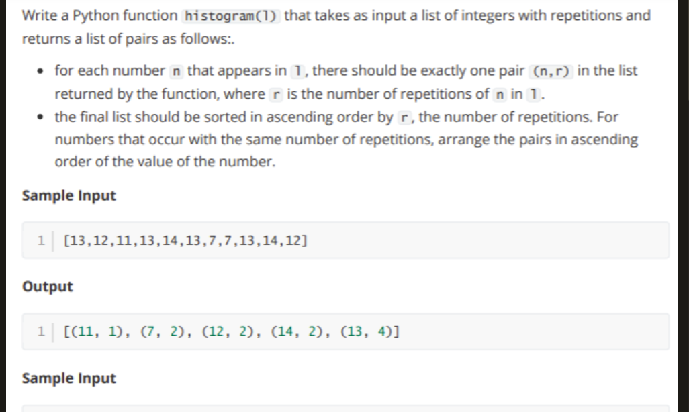

```python
def shuffle(first_list : list , second_list : list )-> list :
    
    first_list_len , second_list_len = len(first_list) , len(second_list)
    
    max_len = 0 
    result = []
    while max_len < max(first_list_len, second_list_len) :
        if max_len < first_list_len:
            result.append(first_list[max_len])
        if max_len < second_list_len:
            result.append(second_list[max_len])
        max_len+=1
    return result
```


```python
def expanding(list_to_check : list ) -> bool:
    
    current_difference = -float("inf")
    
    for index in range(len(list_to_check)-1):
        temp_difference = abs(list_to_check[index+1]-list_to_check[index])
        if current_difference >= temp_difference:
            return False
        else:
            current_difference = temp_difference
    return True 
```


```python
L = [1,3,7,2,-3]
```


```python
expanding(L)
```

    2 3 1
    4 7 3
    5 2 7
    5 -3 2
    ***************************
    5 -3 2


    False


```python
def sumsquare(list_of_value : list)-> list:
    
    odd = 0 
    even = 0
    for value in list_of_value:
        if value%2==0:
            even+= value**2
        else:
            odd += value**2
    return [odd, even]
```


```python
# write code here
def histogram(list_of_value : list )-> list:
    result_dic = {}
    for i in list_of_value:
        if i in result_dic:
            result_dic[i]+=1
        else:
            result_dic[i] = 1 
    return sorted(result_dic.items(), key=lambda item: (item[1], item[0]))
```


```python
histogram([7,12,11,13,7,11,13,14,12])
```


    [(14, 1), (7, 2), (11, 2), (12, 2), (13, 2)]


```python

```
