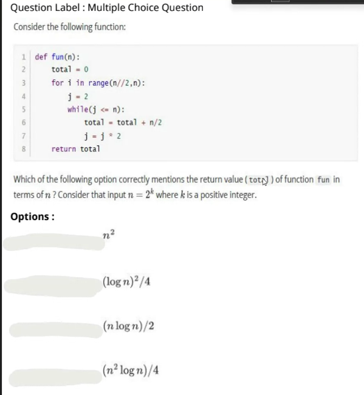

```python
import os
import numpy as np

os.chdir("..")
os.chdir("..")
from driver_folder.time_driver import TimerError
```


```python
25**.5==int(25)**0.5
```


    True


```python
def h(n):
    return n**0.5 == int(n)**0.5
```


```python
h(24)
```


    True


```python
24**0.5
```


    4.898979485566356


```python
int(24)**0.5
```


    4.898979485566356





```python
def fun(m,n):
    if m==n:
        return n 
    else:
        if m > n:
            return fun(m=m-n, n =n )
        else:
            return fun(m , n-m)
```


```python
fun(25,100)
```


    25


```python
def fun(N):
    total  = 0 
    for i in range(N//2, N ):
        j = 2
        while (j <=N):
            total = total + N/2
            j = j * 2 
    return total 
```


```python
fun(1024)
```


    2621440.0


```python
import math 
```


```python
(1024**2 * math.log2(1024) )/4
```


    2621440.0


```python

```
