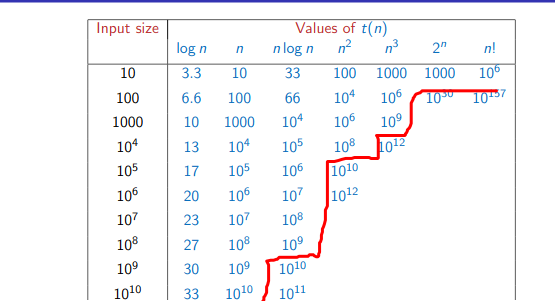

Sim card vs Aadhar card example

- Naive
- smarter approach

Main resources of interest

- running time
- space

Time is depends on the processing power.

- 10^6 operation for python

Storage is limited by available.

Running time depends on the input size.

we will be measure time efficiency as a function of input size.

- input size n
- Running Time  t(n)

$$
\begin{array}{l}
data\ avaiable\ of\ Aadhaar\ -\ n\ \approx \ 10^{9}\\
-\ Naive\ algorithin\ t( n) \ =\ n^{2}\\

-\ clever\ algo\ t( n) \ \approx \ n\ \log_{2} n
\end{array}
$$

Asymptotyic complexity

- means we will be ingonring the coinstants in the function as we will be looking at large value of n (input value )
- When comparingt(n), focus on orders of magnitudeIgnore constant factors.

Typically a natural parameter

- side of the list or array - sort / search
- number of objects we want to re arrange
- for graphs we will have two parameter
  - vertices
  - number of edge

numeric problem 

- magnitude of n is not the correct measure
- Arithmetic operations are performed digit by digitAddition with carry, subtraction with borrow, multiplication, long division .

Ideally, want the “average” behaviour

- Difficult to compute Average over what?
- Are all inputs equally likely?
- Need a probability distribution over inputs

Instead, worst case input

- Input that forces algorithm to take longest possible time
- Search for a value that is not present in an unsorted list
- Must scan all elements
- Pessimistic — worst case may be rare
- **Upper bound for worst case guarantees good performance.**
