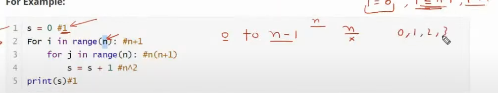

---
for loop in pseudocode is 
i =0 , i<= n-1 , i++  this is equal to
if n = 5 
loop will run for n times then checks and terminate when 
i == n  so total the loop will run for n+1 

j loop will fun for n * (n+1)

**The Cauchy-Schwarz Inequality**

```math
$\left( \sum_{k=1}^n a_k b_k \right)^2 \leq \left( \sum_{k=1}^n a_k^2 \right) \left( \sum_{k=1}^n b_k^2 \right)$
```