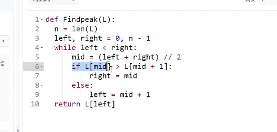

```python
# Write code here
def Findpeak(L):
  left , right = 0 , len(L)-1
  if len(L)==1:
      return L[0]
  largest = -1
  
  while left < right:
    mid_point = L[(left+right)//2]
    largest = max(largest, L[left], L[right] , mid_point)
    if L[left] > mid_point:
      left = (left+right)//2+1
    else:
      right = (left+right)//2-1
  return largest
      


#Suffix Code

res = Findpeak(L)
print(res)

```

    9


```python
L = [1,3,5,7,9,8,6,4,2]
```




```python

def findCommonElements(L1, L2):
    # Create a dictionary to store elements of L1
    element_dict = {}
    for element in L1:
        element_dict[element] = True
    
    # Iterate through L2 and find common elements
    common_elements = []
    for element in L2:
        if element in element_dict:
            common_elements.append(element)
    
    return common_elements
```


```python
def findCommonElements(L1, L2):
    # Sort both lists
    L1.sort()
    L2.sort()
    

    i, j = 0, 0
    common_elements = []
    
    # Traverse both lists
    while i < len(L1) and j < len(L2):
        if L1[i] == L2[j]:
            common_elements.append(L1[i])
            i += 1
            j += 1
        elif L1[i] < L2[j]:
            i += 1
        else:
            j += 1
    
    return common_elements
```


```python
def merge(left, right):
    merged = []
    i, j = 0, 0
    
    while i < len(left) and j < len(right):
        if left[i] < right[j]:
            merged.append(left[i])
            i += 1
        else:
            merged.append(right[j])
            j += 1
    
    # Add any remaining elements
    merged.extend(left[i:])
    merged.extend(right[j:])
    
    return merged

def count_sort(deck):
    # Increment the level as we go deeper into the recursion
    global level 
    level+= 1
    
    if len(deck) <= 2:
        return sorted(deck)
    
    mid = len(deck) // 2
    
    left_sorted_list = count_sort(deck[:mid])
    right_sorted_list = count_sort(deck[mid:])
    
    merged_list = merge(left_sorted_list, right_sorted_list)
    
    # Return the merged list and the maximum level encountered
    return merged_list, 

def subordinates(deck):
    sorted_deck= count_sort(deck)
    return sorted_deck, level
level = 0 

# Test the function with sample inputs
print(subordinates([194, 69, 103, 150, 151, 44, 103, 98]))  # Output: ([44, 69, 98, 103, 103, 150, 151, 194], 4)
print(subordinates([10, 33, 45, 67, 92, 100, 5]))  # Output: ([5, 10, 33, 45, 67, 92, 100], 4)

```

    (([[44, 98, 103, 151], [69, 103, 150, 194]],), 7)
    (([[5, 67, 92, 100], [10, 33, 45]],), 14)


```python

```
