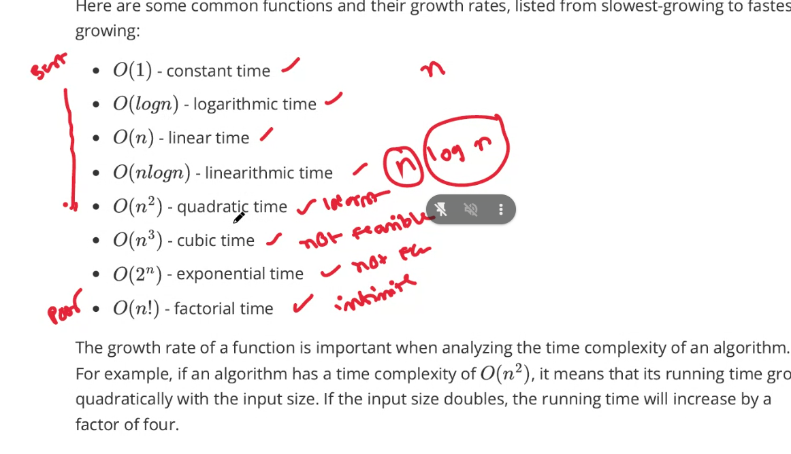

Space Complexity 

- fixed part(C) - size of code
- Variable Part ($S_x$) = the size of the input
- T(X) =  C + $S_x$ = Total space

Time  Complexity 

- Best case
- Average Case
- Worst case

unit of time - how many steps or code is excuteds for a input **n**

notion to represent complexity 

- Big o  O(n) = upper Bound
  - always f(n)  less than or = c * g(n)
- Omega - lower bound
- theta - Tightly bound - average case

