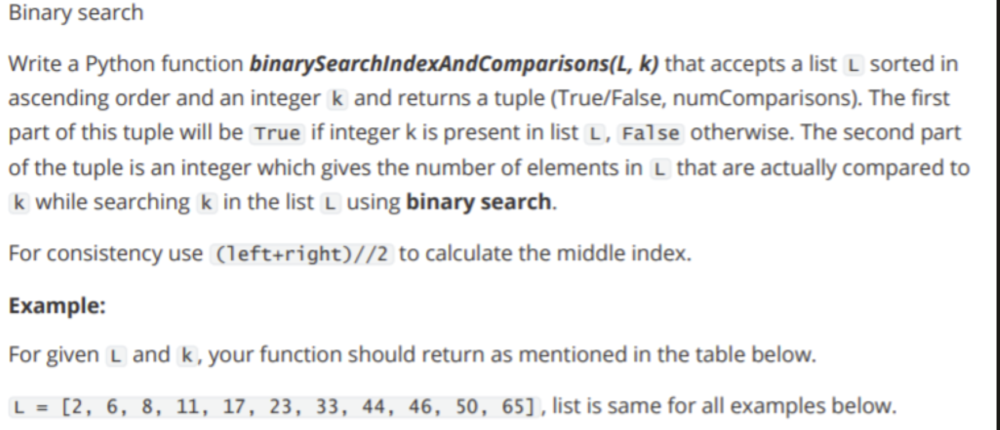
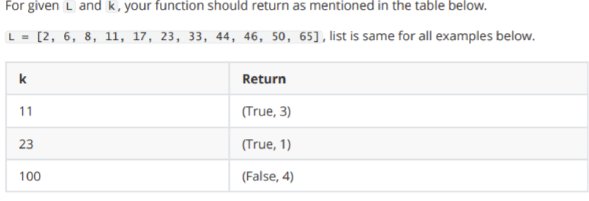

```python
def merge(first_list : list, second_list : list) -> list:
    
    sorted_listed = list() 
    first_list_size = len(first_list)
    second_list_size = len(second_list)
    first_pointer , second_pointer = 0, 0 
    while len(sorted_listed) < first_list_size+second_list_size:
        if first_pointer == first_list_size:
            sorted_listed.extend(second_list[second_pointer:])
            break
        elif second_pointer == second_list_size:
            sorted_listed.extend(first_list[first_pointer:])
            break
        elif first_list[first_pointer] < second_list[second_pointer]:
            sorted_listed.append(first_list[first_pointer])
            first_pointer += 1
        else:
            sorted_listed.append(second_list[second_pointer])
            second_pointer += 1
    return  sorted_listed

def merge_sort( list_to_sort : list) -> list:
    
    if len(list_to_sort) <= 1:
        return list_to_sort
    
    mid = len(list_to_sort) // 2
    
    left = merge_sort(list_to_sort[:mid])
    right = merge_sort(list_to_sort[mid:])
    return merge(left, right)

def  binarySearchIndexAndComparisons(list_to_sort : list , value_to_check) -> tuple:
    search_result =  False
    value_compared = 0
    sorted_list = merge_sort(list_to_sort)
    left , right = 0, len(sorted_list)-1
    while left <=right:
        mid = (left + right) // 2
        value_compared += 1
        if value_to_check == sorted_list[mid]:
            search_result = True
            return (search_result, value_compared)
        elif value_to_check < sorted_list[mid]:
            right = mid-1
        elif value_to_check > sorted_list[mid]:
            left = mid + 1
    return (search_result, value_compared)

    
```


```python
import random
L = [random.randint(1, 100) for i in range(10)]
V = random.randint(1, 100)
print(L)
j = merge_sort(L)
```

    [67, 65, 11, 52, 50, 99, 9, 31, 2, 23]


```python
L=[2, 6, 8, 11, 17, 23, 33, 44, 46, 50, 65]
```


```python
binarySearchIndexAndComparisons(L,100)
```


    (False, 4)


```python
len(L)//2
```


    5


```python
j[5]
```


    54


```python
j
```


    [8, 9, 37, 37, 41, 54, 76, 84, 90, 97]


```python
[0]*4
```


    [0, 0, 0, 0]


# dont return the sorted listed , the sorted has to be same 


```python
def sortInRange(list_to_sort : list,range_value: int)-> list:
    result_dict = {}
    for n in list_to_sort:
        if n in result_dict:
            result_dict[n].append(n)
        else:
            result_dict[n] = [n]
    list_to_sort.clear()
    for i in range(range_value):
        list_to_sort.extend(result_dict.get(i))
    return
```


```python
L = [2 ,0, 1, 1 ,2, 3 ,0, 2, 1 ,0, 2, 3 ,1, 2]
value = 4 

sortInRange(L, 4)
```


```python
L
```


    [0, 0, 0, 1, 1, 1, 1, 2, 2, 2, 2, 2, 3, 3]


```python

```
