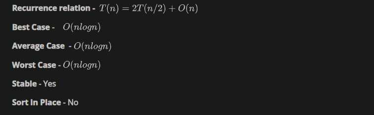

 

Notations to represent complexity
The notation are mathematical notations that are commonly used to describe the time complexity of an algorithm or the upper and lower bounds of how an algorithm's running time grows as the input size grows.

Big-Oh(O) - Upper bound:

Big O notation describes the upper bound of an algorithm's running time. Specifically, we use the notation 
 to describe the maximum growth rate of an algorithm's running time. This means that the algorithm's running time will not grow faster than some constant multiple of 
 as the input size grows.

Omega( $ \Omega $) - Lower bound:

Omega notation, on the other hand, describes the lower bound of an algorithm's running time. Specifically, we use the notation 
 to describe the minimum growth rate of an algorithm's running time. This means that the algorithm's running time will not grow slower than some constant multiple of 
as the input size grows.

Theta( $ \theta$ ) - Tightly bound:

Theta notation describes both the upper and lower bounds of an algorithm's running time. Specifically, we use the notation 
 to describe the tight bound of an algorithm's running time. This means that the algorithm's running time will grow at the same rate as some constant multiple of 
 as the input size grows.


```python
n = 500
s = 0
for i in range(n):
    s = s + 1
print(f" Big0 n = {n} s value {s}")
s = 0
for i in range(n):
    for j in range(n):
        s = s + 1
print(f" Big0 n^2 = {n**2} s value {s}")
s = 0
for i in range(n):
    for j in range(n):
        for k in range(n):
            s = s + 1
print(f" Big0 n^3 = {n**3} s value {s}")
```

     Big0 n = 500 s value 500
     Big0 n^2 = 250000 s value 250000
     Big0 n^3 = 125000000 s value 125000000


## Binary Search 

Algorithm:
Start with a sorted list and a target value.

Set the low and high pointers to the first and last indices of the list, respectively.

While the low pointer is less than or equal to the high pointer: 

A. Calculate the middle index as the average of the low and high pointers (round down if necessary). 

B. If the target value is equal to the middle element of the list, return the middle index. 

C. If the target value is less than the middle element, set the high pointer to the index before the middle index. 

D. If the target value is greater than the middle element, set the low pointer to the index after the middle index.

If the target value is not found in the list, return False (or some other indication that the value is not present).


```python
def merge(first_list , second_list) -> list :
    
    sorted_list = []
    
    first_pointer , second_pointer = 0 , 0 
    
    while first_pointer < len(first_list) and second_pointer < len(second_list):
        
        if first_list[first_pointer] < second_list[second_pointer]:
            sorted_list.append(first_list[first_pointer])
            first_pointer+=1
        else:
            sorted_list.append(second_list[second_pointer])
            second_pointer+=1
    sorted_list.extend(first_list[first_pointer:])
    sorted_list.extend(second_list[second_pointer:])
    
    return sorted_list

def mergesort(L):
    
    n = len(L)
    
    if n==1:
        return L
    left_half = mergesort(L[ : n//2])
    right_half = mergesort(L[n//2:])
    sorted_list = merge(left_half, right_half)
    return sorted_list
```


```python
import random 

L = [random.randint(a=1, b = 100000) for i in range(10000)]

V = random.choice(L)
```


```python
V
```


    27952


```python
import sys
import random


import os

os.chdir("..")
os.chdir("..")
print(f" CWD : {os.getcwd()}")
from driver_folder.time_driver import TimerError
```

     CWD : /home/pk/Desktop/gitmaster/PDSA


```python
J = L.copy()
```


```python
T = TimerError()
T.start()
J.sort()
end_time_1 = T.elapsed()
print(f"time taken:{end_time_1}")
```

    time taken:7.14799971319735e-05


```python
T = TimerError()
T.start()
L = mergesort(L)
end_time = T.elapsed()
print(f"time taken:{end_time}")
```

    time taken:0.013598621997516602


```python
end_time_1- end_time
```


    -0.011775112012401223


```python
def binarysearch(L , v ):
    # L is sorted list     
    low , high = 0 , len(L)-1 
    
    while low <= high:
        mid = (low+high)//2
        if L[mid] < V:
            low = mid+1
        elif L[mid] > v:
            high = mid -1 
        else:
            return True
    return False
```


```python
T = TimerError()
T.start()
print(V in L)
end_time = T.elapsed()
print(f"time taken:{end_time}")
```

    True
    time taken:0.0001255530078196898


```python
T = TimerError()
T.start()
print(binarysearch(L, V))
end_time = T.elapsed()
print(f"time taken:{end_time}")
```

    True
    time taken:0.00010096999176312238


```python
def binarysearch(L, v , low , high):
    if high - low < 0 :
        return False
    mid =  (high+low)//2
    if v == L[mid]:
        return True 
    if v < L[mid]:
        return binarysearch(L , v , low , mid-1)
    else:
        return binarysearch(L , v , mid+1 , high)
```


```python
low = 0 
high = len(L)
```


```python
T = TimerError()
T.start()
print(binarysearch(L, V , low , high))
end_time = T.elapsed()
print(f"time taken:{end_time}")
```

    True
    time taken:7.534401083830744e-05


```python
def binarysearch(L,v):
    if L == []:
        return(False)
    mid = len(L)//2
    if v == L[mid]:
        return mid
    if v < L[mid]:
        return(binarysearch(L[:mid],v))
    else:
        return(binarysearch(L[mid+1:],v))
```


```python
T = TimerError()
T.start()
print(binarysearch(L, V ))
end_time = T.elapsed()
print(f"time taken:{end_time}")
```

    0
    time taken:0.00010571499296929687


## Selection sort


```python
def selection_sort(L):
    
    n = len(L)
    
    if n <=1 :
        return L
    for i in range(n): # n 
        minpos = i 
        for j in range(i+1, n): # n (n-1)
            if L[j] < L[minpos]:
                minpos = j 
        L[i] , L[minpos] = L[minpos] , L[i]
        
    return L 
```




```python
L = [random.randint(a=1, b = 100000) for i in range(10000)]
```


```python
T = TimerError()
T.start()
J.sort()
end_time = T.elapsed()
print(f"time taken:{end_time}")
```

    time taken:0.0008929939940571785


```python
J = L.copy()
```


```python
T = TimerError()
T.start()
_ = selection_sort(J)
end_time = T.elapsed()
print(f"time taken:{end_time}")
```

    time taken:0.9937963989941636


# insert sort 


```python
def Insertsort(L):
    n = len(L)
    if n <=1:
        return L
    for i in range(n):
        j = i 
        while (j>0 ) and L[j] < L[j-1]:
            L[j] , L[j-1] = L[j-1] , L[j]
            j-=1
    return L 
```


```python
J = L.copy()
T = TimerError()
T.start()
_ = Insertsort(J)
end_time = T.elapsed()
print(f"time taken:{end_time}")
```

    time taken:1.605617697990965


```python
def merge_1(A,B): # Merge two sorted list A and B
    (m,n) = (len(A),len(B))
    (C,i,j) = ([],0,0)
    
    #Case 1 :- When both lists A and B have elements for comparing
    while i < m and j < n:
        if A[i] <= B[j]:
            C.append(A[i])
            i += 1
        else:
            C.append(B[j])
            j += 1
    
    #Case 2 :- If list B is over, shift all elements of A to C 
    while i < m:
        C.append(A[i])
        i += 1
    
    #Case 3 :- If list A is over, shift all elements of B to C 
    while j < n:
        C.append(B[j])
        j += 1
    
    # Return sorted merged list   
    return C


# Recursively divide the problem into sub-problems to sort the input list L    
def mergesort_1(L): 
    n = len(L)
    if n <= 1: #If the list contains only one element or is empty return the list.
        return(L)
    Left_Half = mergesort_1(L[:n//2]) #Recursively sort the left half of the list
    Right_Half = mergesort_1(L[n//2:]) #Recursively sort the rightt half of the list
    Sorted_Merged_List = merge_1(Left_Half, Right_Half) # Merge two sorted list Left_Half and Right_Half
    return(Sorted_Merged_List)
```


```python
J = L.copy()
T = TimerError()
T.start()
_ = mergesort(J)
end_time = T.elapsed()
print(f"time taken:{end_time}")
```

    time taken:0.015720170005806722


```python
J = L.copy()
T = TimerError()
T.start()
_ = mergesort_1(J)
end_time = T.elapsed()
print(f"time taken:{end_time}")
```

    time taken:0.008167273001163267


```python
def merge_1(A,B): 
    (m,n) = (len(A),len(B))
    (C,i,j) = ([],0,0)
    global count 
    #Case 1 :- When both lists A and B have elements for comparing
    while i < m and j < n:
        count +=1 
        if A[i] <= B[j]:
            C.append(A[i])
            i += 1
        else:
            C.append(B[j])
            j += 1
    
    #Case 2 :- If list B is over, shift all elements of A to C 
    while i < m:
        count +=1
        C.append(A[i])
        i += 1
    
    #Case 3 :- If list A is over, shift all elements of B to C 
    while j < n:
        count +=1
        C.append(B[j])
        j += 1
    
    # Return sorted merged list   
    return C


count = 0 

L = [1,2,3]
J = [4,5, 6]

merge_1(L, J)

print(len(L), len(J), count )
```

    3 3 6


```python
def Insertsort(L):
    global count 
    n = len(L)
    if n <=1:
        return L
    for i in range(n):
        j = i 
        while (j>0 ) and L[j] < L[j-1]:
            L[j] , L[j-1] = L[j-1] , L[j]
            count +=1
            j-=1
    return L 

count = 0 
L = [38, 28, 43, 22, 112, 33, 39]

Insertsort(L)
```


    [22, 28, 33, 38, 39, 43, 112]


```python
count
```


    9


```python
def merge_1(A,B): 
    (m,n) = (len(A),len(B))
    (C,i,j) = ([],0,0)
    global count 
    #Case 1 :- When both lists A and B have elements for comparing
    while i < m and j < n:
        count +=1 
        if A[i] <= B[j]:
            C.append(A[i])
            i += 1
        else:
            C.append(B[j])
            j += 1
    
    #Case 2 :- If list B is over, shift all elements of A to C 
    while i < m:
        C.append(A[i])
        i += 1
    
    #Case 3 :- If list A is over, shift all elements of B to C 
    while j < n:
        C.append(B[j])
        j += 1
    
    # Return sorted merged list   
    return C

count = 0 

L1 =[4,5,6]
L2=[1,2,3]
L3 = [7,9,11]
L4 = [8,10,12] 

merge_1(merge_1(L1, L2), merge_1(L3, L4))

print(count )
```

    14


```python

```
