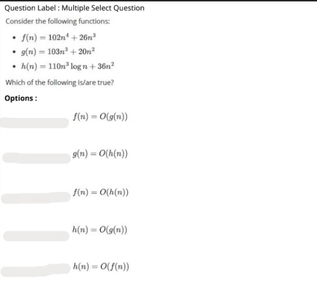
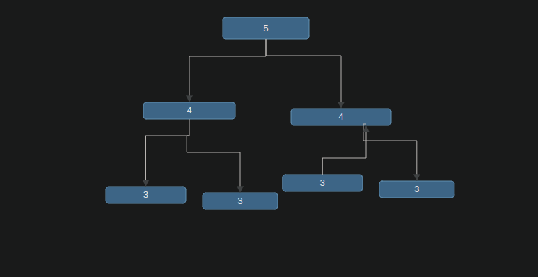

$ T(n) = 2*T(n-1) + 1 $

$ T (n-1) = 2*[2T(n-2) + 1 ] +1  $

$ T(n) = 2^k + k *1 $

when k = n 

$ recurrence = 2T(n-1) + 1$


$ O(2^n)$


first loop # $ \frac{n}{2}$

second loop = $ log\ (n)$

recurrence relationship = $  \frac{n}{2}* log\ (n) $

$ O (n\ log\ (n))$


e , c , 


```python

```
