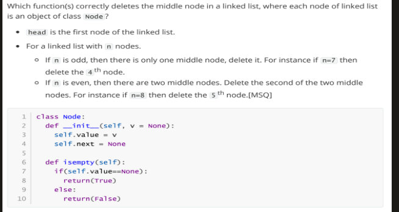
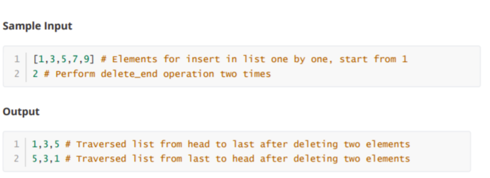

```python
class Node:
  def __init__(self, data):
    self.data = data
    self.next = None
    self.prev = None
class doubly_linked_list:
  def __init__(self):
    self.head = None
    self.last = None
    self.last = None
  def insert_end(self, data):
   
      if self.head is None:
          self.head = Node(data)
      elif self.last is None:
          temp = Node(data)
          self.head.next = temp 
          self.last = temp 
          self.last.prev = self.head
      else:
          temp = Node(data)
          self.last.next = temp
          temp.prev = self.last
          self.last = temp 
  def delete_end(self):
      if self.head is None :
          return None 
      else:
          self.last = self.last.prev
          self.last.next = None 
        
                
                
            
```


```python
def DishPrepareOrder(order_list):
    order_count = {}
    for order in order_list:
        if order in order_count:
            order_count[order] += 1 
        else:
            order_count[order] = 1
    count_dic = {}
    
    for key , value in order_count.items():
        if value in count_dic:
            count_dic[value].append(key)
        else:
            count_dic[value] = [key]
    order_key = sorted(list(count_dic.keys()) , reverse=True )
    result = []
    for final_key in order_key:
        print(final_key)
        result.extend(sorted(count_dic.get(final_key) ,reverse=True))
            
    return result
```


```python
l = [1006, 1008, 1009, 1008, 1007, 1005, 1008, 1001, 1003, 1009, 1006, 1003, 1004, 1002, 1008, 1005, 1004, 1007, 1006, 1002, 1002, 1001, 1004, 1001, 1003, 1007, 1007, 1005, 1004, 1002]
```


```python
di = DishPrepareOrder(l)
```

    4
    3
    2


```python
di
```


    [1008, 1007, 1004, 1002, 1006, 1005, 1003, 1001, 1009]


```python
[key for key, value in sorted(di.items(), key=lambda item: item[1])]
```


    [1009, 1006, 1005, 1001, 1003, 1008, 1007, 1004, 1002]


```python
sorted(di.items(), key=lambda item: item[1] , reverse=True)
```


    [(1008, 4),
     (1007, 4),
     (1004, 4),
     (1002, 4),
     (1006, 3),
     (1005, 3),
     (1001, 3),
     (1003, 3),
     (1009, 2)]


```python
from collections import stack
```


    ---------------------------------------------------------------------------

    ImportError                               Traceback (most recent call last)

    Cell In[67], line 1
    ----> 1 from collections import stack


    ImportError: cannot import name 'stack' from 'collections' (/home/pk/miniconda3/envs/pdsa_1/lib/python3.11/collections/__init__.py)


```python
class stack(object):
    def __init__(self) -> None:
        self.data = []
    def Push(self, data : any):
        self.data.append(data)
    def Pop(self):
        if not self.Isempty():
            return self.data.pop(-1)
        else:
            return None
    def Isempty(self):
        return self.data == []
    def len(self):
        return len(self.data) 
    
def EvaluateExpression(string : str):
    current_stack = stack()
    operators = ["+", "-" , "*" , "/" , "**"]
    for value in string.split(" "):
        if not value in operators:
            current_stack.Push(value)
        else:
            if current_stack.len() > 1 :
                B = int(current_stack.Pop())
                A = int(current_stack.Pop())
                current_stack.Push(evaluate(A, B , operation=value))
            elif current_stack.len() == 1:
                A = int(current_stack.Pop())
                current_stack.Push(evaluate(A=0 , B = A , operation=value))
                
    return current_stack.Pop()
            
def evaluate(A, B , operation):
    if B == None:
        return A * -1
    else:
        if operation == "+":
            return A+B 
        elif operation == "-":
            return A-B
        elif operation == "*":
            return A*B
        elif operation == "/":
            return A/B    
        elif operation == "**":
            return A**B       
                
     
```


```python
def EvaluateExpression(exp):
    stack = []
    
    # Split the expression into tokens
    tokens = exp.split()
    
    # Define the operators and their corresponding functions
    operators = {
        '+': lambda a, b: a + b,
        '-': lambda a, b: a - b,
        '*': lambda a, b: a * b,
        '/': lambda a, b: a / b,
    }
    
    # Scan each element in the given expression
    for token in tokens:
        if token.isdigit():  # if the token is an operand (assuming it's an integer)
            stack.append(int(token))
        elif token in operators:  # if the token is an operator
            b = stack.pop()
            a = stack.pop()
            result = operators[token](a, b)
            stack.append(result)
        else:
            raise ValueError(f"Unexpected token: {token}")
    
    # The final result should be the only element left in the stack
    if len(stack) != 1:
        return None
    
    return stack.pop()


```


```python
1 - 0
```


    1


```python
def eval(o,a,b) :
  if o == '+' :
    return str(float(a)+float(b))
  if o == '-' :
    return str(float(a)-float(b))
  if o == '*' :
    return str(float(a)*float(b))
  if o == '/' :
    return str(float(a)/float(b))
  if o == '**' :
    return str(float(a)**float(b))

def EvaluateExpression(exp) :
  op = ['+','-','','/','*']
  stack = list()
  exp = exp + ' '
  i = 0
  while( i < len(exp)) :
    if exp[i] == ' ' :
      pass
    else :
      j = i
      while(exp[j] != ' ') :
        j += 1
      if exp[i:j] in op :
        b = stack.pop(0)
        a = stack.pop(0)
        c = eval(exp[i:j],a,b)
        stack.insert(0,c)
        i = j+1
      else:
        stack.insert(0,exp[i:j])
        i = j+1      
  return stack[0]
```


```python
" ".join(["10","6","9","3","+","-11","*","/","*","17","+","5","+"])
```


    '10 6 9 3 + -11 * / * 17 + 5 +'


```python
EvaluateExpression(" ".join(["10","6","9","3","+","-11","*","/","*","17","+","5","+"]))
```


    22


```python
class stack(object):
    def __init__(self):
        self.data = []
    def Push(self, data):
        self.data.append(data)
    def Pop(self):
        if not self.Isempty():
            return self.data.pop(-1)
        else:
            return None
    def Isempty(self):
        return self.data == []
    def len(self):
        return len(self.data) 
class Solution(object):
    def evalRPN(self, tokens):
        """
        :type tokens: List[str]
        :rtype: int
        """
        current_stack = stack()
        operators = ["+", "-" , "*" , "/" , "**"]
        for value in tokens:
            if not value in operators:
                current_stack.Push(value)
            else:
                if current_stack.len() > 1 :
                    B = int(current_stack.Pop())
                    A = int(current_stack.Pop())
                    current_stack.Push(int(self.evaluate(A, B , operation=value)))
                elif current_stack.len() == 1:
                    A = int(current_stack.Pop())
                    current_stack.Push(int(self.evaluate(A=0 , B = A , operation=value)))
                    
        return current_stack.Pop()
            
    def evaluate(self, A, B , operation):
        if B == None:
            return A * -1
        else:
            if operation == "+":
                return A+B 
            elif operation == "-":
                return A-B
            elif operation == "*":
                return A*B
            elif operation == "/":
                return A/B    
            elif operation == "**":
                return A**B       
                
```


```python
S = Solution()

S.evalRPN(["10","6","9","3","+","-11","*","/","*","17","+","5","+"])
```


    22


```python
class stack(object):
    def __init__(self) -> None:
        self.data = []
    def Push(self, data : any):
        self.data.append(data)
    def Pop(self):
        if not self.Isempty():
            return self.data.pop(-1)
        else:
            return None
    def Isempty(self):
        return self.data == []
    def len(self):
        return len(self.data) 
    
def EvaluateExpression(tokens ):
    current_stack = stack()
    operators = ["+", "-" , "*" , "/" , "**"]
    for value in tokens:
        if not value in operators:
            current_stack.Push(value)
        else:
            if current_stack.len() > 1 :
                B = int(current_stack.Pop())
                A = int(current_stack.Pop())
                current_stack.Push(int(evaluate(A, B , operation=value)))
            elif current_stack.len() == 1:
                A = int(current_stack.Pop())
                current_stack.Push(evaluate(A=0 , B = A , operation=value))
                
    return current_stack.Pop()
            
def evaluate(A, B , operation):
    if B == None:
        return A * -1
    else:
        if operation == "+":
            return A+B 
        elif operation == "-":
            return A-B
        elif operation == "*":
            return A*B
        elif operation == "/":
            return A/B    
        elif operation == "**":
            return A**B       
                
```


```python
EvaluateExpression(["10","6","9","3","+","-11","*","/","*","17","+","5","+"])
```


    22


```python
def EvaluateRPN(tokens):
    stack = []
    
    # Define the operators and their corresponding functions
    operators = {
        '+': lambda a, b: a + b,
        '-': lambda a, b: a - b,
        '*': lambda a, b: a * b,
        '/': lambda a, b: int(a / b)  # use int to truncate toward zero
    }
    
    # Scan each token in the given expression
    for token in tokens:
        if token.lstrip('-').isdigit():  # if the token is an operand (including negative numbers)
            stack.append(int(token))
        elif token in operators:  # if the token is an operator
            b = stack.pop()
            a = stack.pop()
            result = operators[token](a, b)
            stack.append(result)
        else:
            raise ValueError(f"Unexpected token: {token}")
    
    # The final result should be the only element left in the stack
    if len(stack) != 1:
        raise ValueError("The input postfix expression is invalid.")
    
    return stack.pop()

# Example usage:
tokens1 = ["2", "1", "+", "3", "*"]
tokens2 = ["4", "13", "5", "/", "+"]
tokens3 = ["10", "6", "9", "3", "+", "-11", "*", "/", "*", "17", "+", "5", "+"]

print(EvaluateRPN(tokens1))  # Output: 9
print(EvaluateRPN(tokens2))  # Output: 6
print(EvaluateRPN(tokens3))  # Output: 22

```

    9
    6
    22


```python
int(6/-132)
```


    0


```python
[0, 17 ]
```


```python
class stack(object):
    def __init__(self) -> None:
        self.data = []
    def Push(self, data : any):
        self.data.append(data)
    def Pop(self):
        if not self.Isempty():
            return self.data.pop(-1)
        else:
            return None
    def Isempty(self):
        return self.data == []
    def len(self):
        return len(self.data) 
    
def EvaluateExpression(string : str):
    current_stack = stack()
    operators = ["+", "-" , "*" , "/" , "**"]
    for value in string.split(" "):
        if not value in operators:
            current_stack.Push(value)
        else:
            if current_stack.len() > 1 :
                B = int(current_stack.Pop())
                A = int(current_stack.Pop())
                current_stack.Push(int(evaluate(A, B , operation=value)))
            elif current_stack.len() == 1:
                A = int(current_stack.Pop())
                current_stack.Push(int(evaluate(A=0 , B = A , operation=value)))
                
    return current_stack.Pop()
            
def evaluate(A, B , operation):
    if B == None:
        return A * -1
    else:
        if operation == "+":
            return A+B 
        elif operation == "-":
            return A-B
        elif operation == "*":
            return A*B
        elif operation == "/":
            return A/B    
        elif operation == "**":
            return A**B       
                     
                
     
     
print(float(EvaluateExpression(input())))
```

    -4.0


```python
current=  stack()

```


```python
ex = iter(["10","6","9","3","+","-11","*","/","*","17","+","5","+"])
```


```python
value = ex.__next__()
```


```python
value
```


    '+'


```python
current.Push(value)
```


```python
current.Pop()
```


    0


```python
b = int(current.Pop())
a = int(current.Pop())
```


```python
a, b
```


    (0, 17)


```python
current.Push(0+17)
```


```python
class Solution:
    def resolves(self, a, b, Operator):
        if Operator == '+':
            return a + b
        elif Operator == '-':
            return a - b
        elif Operator == '*':
            return a * b
        return int(a / b)

    def evalRPN(self, tokens):
        stack = []
        for token in tokens:
            if len(token) == 1 and ord(token) < 48:
                integer2 = stack.pop()
                integer1 = stack.pop()
                operator = token
                resolved_ans = self.resolves(integer1, integer2, operator)
                stack.append(resolved_ans)
            else:
                stack.append(int(token))
        return stack.pop()


```


```python

```


```python
import math 

math.ceil(-0.4)
```


    0


```python
class stack(object):
    def __init__(self) -> None:
        self.data = []
    def Push(self, data : any):
        self.data.append(data)
    def Pop(self):
        if not self.Isempty():
            return self.data.pop(-1)
        else:
            return None
    def Isempty(self):
        return self.data == []
    def len(self):
        return len(self.data) 
    
def EvaluateExpression(string : str):
    current_stack = stack()
    operators = ["+", "-" , "*" , "/" , "**"]
    for value in string.split(" "):
        if value in operators:
            B = current_stack.Pop()
            A = current_stack.Pop()
            value_to_append = evaluate(A=A , B= B , operation=value)
            current_stack.Push(value_to_append)
        else:
            current_stack.Push(int(value))
            
        
                
    return current_stack.Pop()
            
def evaluate(A, B , operation):
    if B == None:
        return A * -1
    else:
        if operation == "+":
            return A+B 
        elif operation == "-":
            return A-B
        elif operation == "*":
            return A*B
        elif operation == "/":
            return int(A/B)    
        elif operation == "**":
            return A**B       
                     
                
     
     
print(float(EvaluateExpression(input())))
```


```python
def reverse(root):
    prev = None 
    while root.value is not None:
        next = root.next 
        root.next = prev
        root.value = next 
    root.value = prev
    return root
```


```python
def reverse(root):
    prev = None 
    while root is not None:
        next_value = root.next 
        root.next = prev
        prev = root 
        root = next_value
    
        
    return prev
```


```python
8//2
```


    4


```python
class Node(object):
    def __init__(self , v = None ) -> None:
        self.value = v 
        self.next = None 
        
    def isempty(self):
        return self.value == None 
class Linklist(object):
    def __init__(self) -> None:
        self.head = None 
    def insert_at_last(self, data ):
        new_node = Node(data)
        if self.head == None:
            self.head = new_node 
        else:
            current = self.head 
            while current.next is not None:
                current = current.next 
            current.next = new_node
    def print_list(self):
        """
        Prints the contents of the linked list.
        """
        current = self.head
        while current is not None:
            print(current.value, end=" -> ")
            current = current.next
        print("None")
```


```python
import random 

l = [random.randint(1,100) for _ in range(7)]
```


```python
link_list = Linklist()

for j in l:
    link_list.insert_at_last(j)
```


```python
link_list.print_list()
```

    37 -> 2 -> 80 -> 92 -> 97 -> 19 -> 10 -> None


```python
def deleteMiddle(head):
    size = 0 
    curr = head 
    while curr:
        size +=1 
        curr = curr.next
    curr = head 
    for _ in range(1,size//2):
        curr = curr.next 
    curr.next = curr.next.next 

```


```python
deleteMiddle(link_list.head)
```


```python
link_list.print_list()
```

    8 -> 32 -> 57 -> 85 -> 22 -> 68 -> None


```python
def deleteMiddle(head):
    curr = currFast = head
    currPrev = None
    flag = False
    while (currFast):
        if (flag):
            currPrev = curr
            curr =  curr.next
        currFast = currFast.next
        flag = not flag
    currPrev.next = currPrev.next.next
```


```python
deleteMiddle(link_list.head)
```


```python
link_list.print_list()
```

    37 -> 2 -> 80 -> 97 -> 19 -> 10 -> None


```python
class Hashing:
    def __init__(self,c1,c2,m):
        self.hashtable = []
        for i in range(m):
            self.hashtable.append(None)     
        self.c1 = c1
        self.c2 = c2
        self.m = m
        
    def hashfunction(self, data  ):
        i = 0 
        key = (data%self.m + self.c1*i+self.c2*(i**2))%self.m 
        while self.hashtable[key] != None and i< self.m:
            key = (data%self.m + self.c1*i+ self.c2*(i**2))%self.m 
            i+=1
        return key 
    
    def store_data(self, data):
        if self.hashtable.count(None) !=0: 
            key = self.hashfunction(data=data)
            self.hashtable[key] = data 
        else:
            print("Hast table is full")
    def display_hashtable(self):
        return self.hashtable
        
        
    

```


```python
c1 = 1
c2 = 1
m = 11
data= [22,44,35,54,36,27]
A = Hashing(c1,c2,m)
for i in data:
	A.store_data(i)
print(A.display_hashtable())
```

    0
    2
    2
    4
    [22, None, 44, 36, 35, 27, None, None, None, None, 54]


```python

[11, 12, 13, 14, 15, 16, 17, 18, 19, 20, 10] == [11, 12, 13, 14, 15, 16, 17, 18, 19, 20, 10]
```


    True


```python

[11, 12, 13, 14, 15, 16, 17, 18, 19, 20, 10]

```


```python

```
