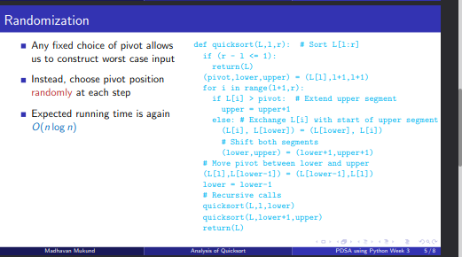

```python

import sys
from loguru import logger
import random
import time

logger.remove()
logger.add(sys.stdout, colorize=True,format="<level>{level}</level> | <blue>{message}</blue>")
class TimerError(Exception):
    def __init__(self) -> None:
        self._start_time = None 
        self._stop_time = None 
        self.elapsed_time = None
        
    def start(self):
        if self._start_time != None:
            raise TimerError(" please stop the timer")
        self._start_time = time.perf_counter()
        self._stop_time = None
    
    def stop(self):
        if self._start_time == None:
            raise TimerError("please start the timer")
        self._stop_time = time.perf_counter()
        self.elapsed_time = self._stop_time - self._start_time
        self._start_time = None 
    def elapsed(self):
        if self.elapsed == None and self._start_time== None:
            raise TimerError("the counter not running")
        else:
            self.stop()
            return self.elapsed_time
    def __str__(self) -> str:
        return (str(self.elapsed_time))

T =TimerError()
T.start()
end_time = T.elapsed()
logger.info(f"time taken:{end_time}")
```

    INFO | time taken:1.97930057765916e-05




# choose the pivot element - randomly 
- uniformly disturbed between 0 to (n-1) where n is the number of elements 

