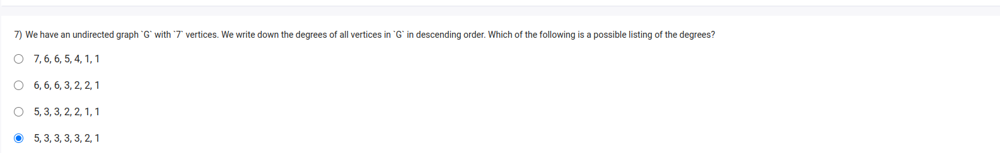

To determine a possible listing of the degrees of vertices in an undirected graph with 7 vertices, we need to consider some fundamental properties and constraints of graphs:

1. **Handshaking Lemma**: The sum of the degrees of all vertices in an undirected graph is twice the number of edges. This implies that the sum of the degrees must be even.
2. **Degree Sequence**: A sequence is a degree sequence if it can be realized as the degree sequence of some graph. The sequence must satisfy the Erdős–Gallai theorem, which provides a necessary and sufficient condition for a sequence to be graphical.

Given these properties, let's evaluate each of the provided degree sequences.

### Checking Each Sequence

1. **Sequence: 6, 6, 5, 4, 3, 2, 1**

   - Sum of degrees = 6 + 6 + 5 + 4 + 3 + 2 + 1 = 27
   - Sum is odd, so this cannot be a valid degree sequence.
2. **Sequence: 5, 5, 5, 4, 3, 2, 2**

   - Sum of degrees = 5 + 5 + 5 + 4 + 3 + 2 + 2 = 26
   - Sum is even. Now we need to check if it satisfies the Erdős–Gallai conditions:
     - \( k = 1 \): \( 5 \leq 6 \) (6 is the sum of the smallest 6 degrees)
     - \( k = 2 \): \( 10 \leq 10 \) (10 is the sum of the smallest 5 degrees)
     - \( k = 3 \): \( 15 \leq 15 \) (15 is the sum of the smallest 4 degrees)
     - \( k = 4 \): \( 19 \leq 19 \) (19 is the sum of the smallest 3 degrees plus the number of edges formed by them)
     - \( k = 5 \): \( 22 \leq 23 \) (22 is the sum of the smallest 2 degrees plus the number of edges formed by them)
     - \( k = 6 \): \( 24 \leq 26 \) (24 is the sum of the smallest 1 degree plus the number of edges formed by them)
   - Since all conditions are satisfied, this is a possible degree sequence.
3. **Sequence: 6, 6, 6, 3, 2, 1, 1**

   - Sum of degrees = 6 + 6 + 6 + 3 + 2 + 1 + 1 = 25
   - Sum is odd, so this cannot be a valid degree sequence.
4. **Sequence: 4, 4, 4, 4, 3, 3, 2**

   - Sum of degrees = 4 + 4 + 4 + 4 + 3 + 3 + 2 = 24
   - Sum is even. Now we need to check if it satisfies the Erdős–Gallai conditions:
     - \( k = 1 \): \( 4 \leq 6 \)
     - \( k = 2 \): \( 8 \leq 10 \)
     - \( k = 3 \): \( 12 \leq 13 \)
     - \( k = 4 \): \( 16 \leq 16 \)
     - \( k = 5 \): \( 19 \leq 19 \)
     - \( k = 6 \): \( 22 \leq 24 \)
   - Since all conditions are satisfied, this is a possible degree sequence.
5. **Sequence: 5, 5, 4, 4, 3, 2, 1**

   - Sum of degrees = 5 + 5 + 4 + 4 + 3 + 2 + 1 = 24
   - Sum is even. Now we need to check if it satisfies the Erdős–Gallai conditions:
     - \( k = 1 \): \( 5 \leq 6 \)
     - \( k = 2 \): \( 10 \leq 10 \)
     - \( k = 3 \): \( 14 \leq 13 \) (Fails here)
   - Since one condition fails, this is not a possible degree sequence.

### Conclusion

Based on the evaluation, the possible listings of degrees are:

- **5, 5, 5, 4, 3, 2, 2**
- **4, 4, 4, 4, 3, 3, 2**

So, the sequences \( \boxed{5, 5, 5, 4, 3, 2, 2} \) and \( \boxed{4, 4, 4, 4, 3, 3, 2} \) are possible listings of the degrees.
