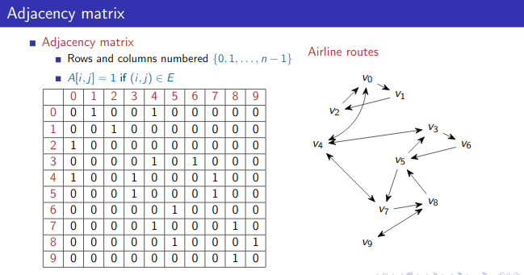

```python
import sys
import random
import os

os.chdir("..")
os.chdir("..")
from driver_folder.time_driver import TimerError
```


```python
T = TimerError()
T.start()
end_time = T.elapsed()
print(f"time taken:{end_time}")
```

    time taken:1.3933000445831567e-05


```python
edges = [
    (0, 1),
    (0, 4),
    (1, 2),
    (2, 0),
    (3, 4),
    (3, 6),
    (4, 0),
    (4, 3),
    (4, 7),
    (5, 3),
    (5, 7),
    (6, 5),
    (7, 4),
    (7, 8),
    (8, 5),
    (8, 9),
    (9, 8),
]
```


```python
import numpy as np
```


```python
A = np.zeros(shape=(10, 10))
```


```python
for i, j in edges:
    A[i, j] = 1
```


```python
A
```


    array([[0., 1., 0., 0., 1., 0., 0., 0., 0., 0.],
           [0., 0., 1., 0., 0., 0., 0., 0., 0., 0.],
           [1., 0., 0., 0., 0., 0., 0., 0., 0., 0.],
           [0., 0., 0., 0., 1., 0., 1., 0., 0., 0.],
           [1., 0., 0., 1., 0., 0., 0., 1., 0., 0.],
           [0., 0., 0., 1., 0., 0., 0., 1., 0., 0.],
           [0., 0., 0., 0., 0., 1., 0., 0., 0., 0.],
           [0., 0., 0., 0., 1., 0., 0., 0., 1., 0.],
           [0., 0., 0., 0., 0., 1., 0., 0., 0., 1.],
           [0., 0., 0., 0., 0., 0., 0., 0., 1., 0.]])





```python
def neighbours(AMat, i):
    nbrs = []
    (rows, cols) = AMat.shape
    for j in range(cols):
        if AMat[i, j] == 1:
            nbrs.append(j)
            return nbrs
```


```python
neighbours(A, 7)
```


    [4]


```python

```
