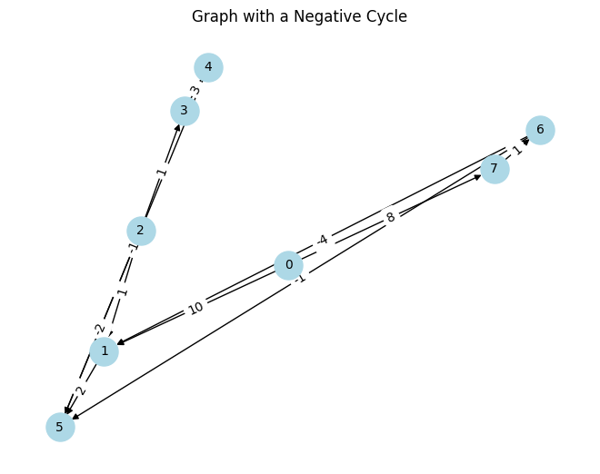

```python
import os
import numpy as np

import networkx as nx
import matplotlib.pyplot as plt

os.chdir("..")
os.chdir("..")
from driver_folder.time_driver import TimerError
```


```python
T = TimerError()
T.start()
end_time = T.elapsed()
print(f"time taken:{end_time}")
```

    time taken:1.1470001481939107e-05


```python
def floydwarshall(WMat):

    rows, cols, x = WMat.shape
    # transitive closure matrix
    SP = np.full((rows, cols, cols + 1), np.inf)
    infinity = np.max(WMat) * rows * rows + 1
    closure = 0
    connection = 0
    weight = 1
    # for vertex in range(rows):
    #     for child in range(cols):
    #         SP[vertex,child, closure] = infinity

    for vertex in range(rows):
        for child in range(cols):
            if WMat[vertex, child, connection] == 1:
                SP[vertex, child, closure] = WMat[vertex, child, weight]
    for closure_loop in range(1, cols + 1):
        for vertex in range(rows):
            for child in range(cols):
                SP[vertex, child, closure_loop] = min(
                    SP[vertex, child, closure_loop - 1],
                    SP[vertex, closure_loop - 1, closure_loop - 1]
                    + SP[closure_loop - 1, child, closure_loop - 1],
                )
    return SP[:, :, cols]
```


```python
# Number of nodes
num_nodes = 8

# Initialize adjacency matrix with inf (representing no connection)
adj_matrix = np.zeros((num_nodes, num_nodes, 2))

# Define the edges and their weights
edges = [
    (0, 1, 10),
    (0, 7, 8),
    (1, 5, 2),
    (2, 1, 1),
    (2, 3, 1),
    (3, 4, 3),
    (4, 5, -1),
    (5, 2, -2),
    (6, 1, -4),
    (6, 5, -1),
    (7, 6, 1),
]

# Fill the adjacency matrix with the edge weights
for edge in edges:
    u, v, weight = edge
    adj_matrix[u, v] = [1, weight]

# Create a NetworkX graph
G = nx.DiGraph()

# Add edges with weights to the graph
for u, v, weight in edges:
    G.add_edge(u, v, weight=weight)

# Draw the graph
pos = nx.spring_layout(G)  # Positions for all nodes
nx.draw(
    G,
    pos,
    with_labels=True,
    node_color="lightblue",
    node_size=500,
    font_size=10,
    arrows=True,
)

# Draw edge labels
edge_labels = {(u, v): f'{d["weight"]:.0f}' for u, v, d in G.edges(data=True)}
nx.draw_networkx_edge_labels(G, pos, edge_labels=edge_labels, font_size=10)

plt.title("Graph with a Negative Cycle")
plt.show()
```


    

    


```python
distance = floydwarshall(adj_matrix)
```


```python
distance
```


    array([[inf,  5.,  5.,  6.,  9.,  7.,  9.,  8.],
           [inf,  1.,  0.,  1.,  4.,  2., inf, inf],
           [inf,  1.,  1.,  1.,  4.,  3., inf, inf],
           [inf,  1.,  0.,  1.,  3.,  2., inf, inf],
           [inf, -2., -3., -2.,  1., -1., inf, inf],
           [inf, -1., -2., -1.,  2.,  1., inf, inf],
           [inf, -4., -4., -3.,  0., -2., inf, inf],
           [inf, -3., -3., -2.,  1., -1.,  1., inf]])


```python

```
