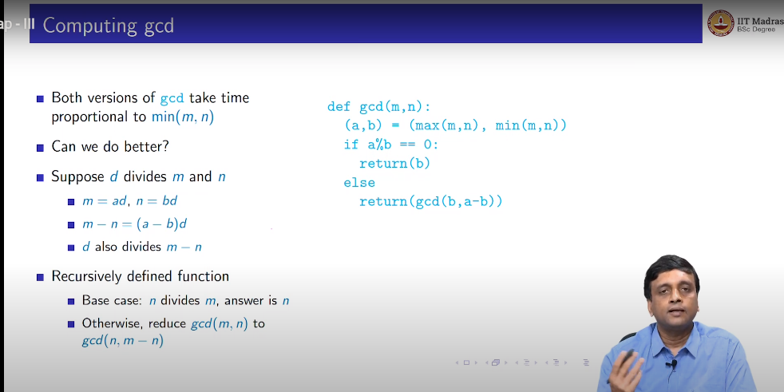

```python
import matplotlib.pyplot as plt 
import math 
import logging
logging.basicConfig(level=logging.DEBUG) 
```


```python
def prime(n):
    result , i = True , 2
    while result and i < math.sqrt(n):
        if n%i == 0:
            result = False
        i+=1
    return result        
```


```python
prime(17)
```


    True


```python
def gcd( m : int , n : int )-> int:
    (a, b) = (max(m,n) , min(m,n))
    print(f" a: {a} , b:{b}")
    if a%b == 0:
        return b 
    else:
        return gcd(b, a-b)
    
    
    
```




```python
gcd(188,99)
```

     a: 188 , b:99
     a: 99 , b:89
     a: 89 , b:10
     a: 79 , b:10
     a: 69 , b:10
     a: 59 , b:10
     a: 49 , b:10
     a: 39 , b:10
     a: 29 , b:10
     a: 19 , b:10
     a: 10 , b:9
     a: 9 , b:1


    1


```python

```
